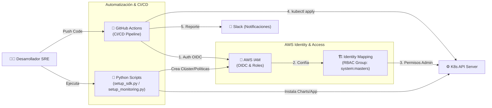
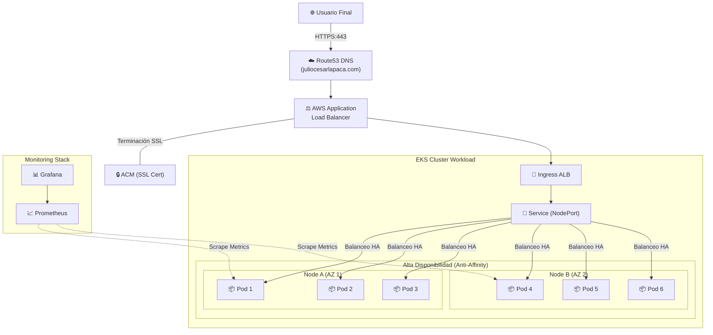

# 🚀 EKS SRE Automation Demo: Amazon Web App

Este proyecto es una implementación profesional de **Site Reliability Engineering (SRE)** diseñada para desplegar una aplicación web escalable y de alta disponibilidad en **Amazon EKS**. Automatiza todo el ciclo de vida: desde el aprovisionamiento de infraestructura con Python hasta el monitoreo proactivo y el CI/CD con seguridad integrada.

---

## 🏗️ Arquitectura del Sistema

### 1. Workflow de Automatización (CI/CD)
Este flujo describe cómo el código viaja desde el desarrollo hasta el clúster usando **OIDC** para una autenticación segura sin necesidad de llaves de acceso estáticas.



### 2. Infraestructura de Alta Disponibilidad
Muestra la distribución de la carga de trabajo. Se implementó Pod Anti-Affinity para forzar la distribución de las 6 réplicas entre diferentes nodos físicos, evitando puntos únicos de fallo.


### 3. Diagrama de arquitectura EKS


---

## 🛠️ Tecnologías y Herramientas

| Componente | Tecnología | Propósito |
| --- | --- | --- |
| **Nube** | Amazon EKS (K8s v1.34) | Orquestación de contenedores |
| **IaC** | Python 3 + Boto3 | Automatización de infraestructura y permisos IAM |
| **Ingress** | AWS Load Balancer Controller | Gestión dinámica de ALBs en AWS |
| **DNS** | ExternalDNS | Sincronización automática con Route53 |
| **Monitoreo** | Prometheus & Grafana | Observabilidad y Dashboards de métricas |
| **CI/CD** | GitHub Actions | Pipeline con seguridad OIDC y Linting |

---

## 🚀 Guía de Inicio Rápido
### 1. Despliegue de Infraestructura Base
Ejecuta el script principal para crear el clúster, las políticas IAM y el identity mapping RBAC necesario para el pipeline:
   ```bash
   python3 setup_sdk.py
   ```
### 2. Configuración del Stack de Monitoreo
Instala Prometheus y expón Grafana bajo un subdominio seguro (HTTPS):
   ```bash
   python3 setup_monitoring.py
   ```
### 3. Automatización de Despliegue (CI/CD)
Cada push a main activa el pipeline que valida el manifiesto amazon-generated.yaml, extrae los límites de recursos y realiza el despliegue informando a Slack.


---

## 📊 Estrategia de Ingeniería de Fiabilidad (SRE)
* **Resiliencia con Anti-Affinity:** Se configuró una regla de podAntiAffinity para asegurar que las réplicas no compartan el mismo nodo, protegiendo la aplicación ante la caída de un servidor físico.

* **Fine-Tuning de Recursos:** Tras analizar el consumo real (~515Mi RAM y <1m CPU), se definieron reservas estables de 50m CPU y 550Mi RAM para optimizar el coste sin sacrificar estabilidad.

* **Seguridad y Acceso:** Se eliminó el uso de credenciales de larga duración mediante OIDC y se habilitó un escaneo de seguridad (Linting) no bloqueante para auditoría continua.

---

## 📖 Glosario Técnico
* **OIDC (OpenID Connect):** Protocolo para que GitHub Actions asuma roles de AWS de forma temporal y segura.

* **IRSA:** Asignación de permisos de AWS (IAM) directamente a cuentas de servicio de Kubernetes.

* **Identity Mapping:** Configuración en EKS para otorgar permisos administrativos al rol de GitHub Actions.

* **Pod Anti-Affinity:** Regla que distribuye pods en diferentes nodos para alta disponibilidad.

---
 
## 🔧 Comandos de Operación SRE
```bash
# Validar distribución de pods entre nodos (Anti-Affinity Check)
kubectl get pods -o custom-columns=NAME:.metadata.name,NODE:.spec.nodeName

# Monitorear logs de despliegue
kubectl rollout status deployment/amazon-deployment

# Verificar estado de registros DNS automáticos
kubectl logs -f deployment/external-dns
```


