```mermaid
graph LR
    dev["👨‍💻 Desarrollador SRE"]
    slack["📢 Slack (Notificaciones)"]

    subgraph "Automatización & CI/CD"
        python_scripts["🐍 Python Scripts<br/>(setup_sdk.py / setup_monitoring.py)"]
        gh_actions["🚀 GitHub Actions<br/>(CI/CD Pipeline)"]
    end

    subgraph "AWS Identity & Access"
        iam["🔑 AWS IAM<br/>(OIDC & Roles)"]
        mapping["🏗️ Identity Mapping<br/>(RBAC Group: system:masters)"]
    end

    api_server["⚙️ K8s API Server"]

    dev -->|Ejecuta| python_scripts
    dev -->|Push Code| gh_actions
    python_scripts -->|Crea Clúster/Políticas| iam
    python_scripts -->|Instala Charts/App| api_server
    gh_actions -- "1. Auth OIDC" --> iam
    iam -- "2. Confía" --> mapping
    mapping -- "3. Permisos Admin" --> api_server
    gh_actions -- "4. kubectl apply" --> api_server
    gh_actions -- "5. Reporte" --> slack
```

# 🚀 EKS SRE Automation Demo: Amazon Web App

This project is a professional Site Reliability Engineering (SRE) implementation designed to deploy a scalable and highly available web application on Amazon EKS. It automates the entire lifecycle: from infrastructure provisioning with Python to proactive monitoring and CI/CD with integrated security

---

## 🏗️ Arquitectura del Sistema

### 1. Automation Workflow (CI/CD)
This flow describes how code travels from development to the cluster using OIDC for secure authentication without the need for static access keys.



### 2. High Availability Infrastructure
Displays workload distribution. Pod Anti-Affinity was implemented to force the distribution of the 6 replicas across different physical nodes, avoiding single points of failure.

```mermaid
graph TD
    user["🌐 Usuario Final"]
    route53["☁️ Route53 DNS<br/>(juliocesarlapaca.com)"]
    alb["⚖️ AWS Application<br/>Load Balancer"]
    acm["🔒 ACM (SSL Cert)"]

    subgraph "EKS Cluster Workload"
        ingress["🚪 Ingress ALB"]
        service["🔄 Service (NodePort)"]
        
        subgraph "Alta Disponibilidad (Anti-Affinity)"
            subgraph "Node A (AZ 1)"
                pod1["📦 Pod 1"]
                pod2["📦 Pod 2"]
                pod3["📦 Pod 3"]
            end
            subgraph "Node B (AZ 2)"
                pod4["📦 Pod 4"]
                pod5["📦 Pod 5"]
                pod6["📦 Pod 6"]
            end
        end
    end

    subgraph "Monitoring Stack"
        prom["📈 Prometheus"]
        grafana["📊 Grafana"]
    end

    user -- "HTTPS:443" --> route53
    route53 --> alb
    alb -- "Terminación SSL" --- acm
    alb --> ingress
    ingress --> service
    service -- "Balanceo HA" --> pod1 & pod2 & pod3 & pod4 & pod5 & pod6
    prom -. "Scrape Metrics" .-> pod1 & pod4
    grafana --> prom
```


### 3. Diagrama de arquitectura EKS


---

## 🛠️ Technologies and Tools

| Component | Technology | Purpose |
| --- | --- | --- |
| **Cloud** | Amazon EKS (K8s v1.34) | Container orchestation |
| **IaC** | Python 3 + Boto3 | Infrastructure automation and IAM permissions |
| **Ingress** | AWS Load Balancer Controller | Dynamic ALB management on AWS |
| **DNS** | ExternalDNS | Automatic synchronization with Route53 |
| **Monitoring** | Prometheus & Grafana | Observability and metrics Dashboards |
| **CI/CD** | GitHub Actions | Pipeline with OIDC security and Linting |

---

## 🚀 Quick Start Guide
### 1. Base Infrastructure Deployment
Run the main script to create the cluster, IAM policies, and the RBAC identity mapping required for the pipeline:
   ```bash
   python3 setup_sdk.py
   ```
### 2. Monitoring Stack Configuration
Install Prometheus and expose Grafana under a secure subdomain (HTTPS):
   ```bash
   python3 setup_monitoring.py
   ```
### 3. Deployment Automation (CI/CD)
Every push to main triggers the pipeline that validates the amazon-generated.yaml manifest, extracts resource limits, and performs the deployment while notifying Slack.

---

## 📊 Site Reliability Engineering (SRE) Strategy
* **Resilience with Anti-Affinity:** Se configuró una regla de podAntiAffinity para asegurar que las réplicas no compartan el mismo nodo, protegiendo la aplicación ante la caída de un servidor físico.

* **Resource Fine-Tuning:** After analyzing real consumption (~515Mi RAM and <1m CPU), stable reservations of 50m CPU and 550Mi RAM were defined to optimize costs without sacrificing stability.

* **Security and Access:** The use of long-lived credentials was eliminated via OIDC, and a non-blocking security scan (Linting) was enabled for continuous auditing.

---

## 📖 Technical Glossary
* **OIDC (OpenID Connect):** Protocol for GitHub Actions to assume AWS roles temporarily and securely.

* **IRSA:** Assignment of AWS permissions (IAM) directly to Kubernetes Service Accounts.

* **Identity Mapping:** EKS configuration to grant administrative permissions to the GitHub Actions role.

* **Pod Anti-Affinity:** Rule that distributes pods across different nodes for high availability.

---
 
## 🔧 SRE Operational Commands
```bash
# Validate pod distribution across nodes (Anti-Affinity Check)
kubectl get pods -o custom-columns=NAME:.metadata.name,NODE:.spec.nodeName

# Monitor deployment logs
kubectl rollout status deployment/amazon-deployment

# Verify automatic DNS record status
kubectl logs -f deployment/external-dns
```


