```mermaid
graph TD
    user["🌐 Usuario Final"]
    route53["☁️ Route53 DNS<br/>(juliocesarlapaca.com)"]
    alb["⚖️ AWS Application<br/>Load Balancer"]
    acm["🔒 ACM (SSL Cert)"]

    subgraph "EKS Cluster Workload"
        ingress["🚪 Ingress ALB"]
        service["🔄 Service (NodePort)"]
        
        subgraph "Alta Disponibilidad (Anti-Affinity)"
            subgraph "Node A (AZ 1)"
                pod1["📦 Pod 1"]
                pod2["📦 Pod 2"]
                pod3["📦 Pod 3"]
            end
            subgraph "Node B (AZ 2)"
                pod4["📦 Pod 4"]
                pod5["📦 Pod 5"]
                pod6["📦 Pod 6"]
            end
        end
    end

    subgraph "Monitoring Stack"
        prom["📈 Prometheus"]
        grafana["📊 Grafana"]
    end

    user -- "HTTPS:443" --> route53
    route53 --> alb
    alb -- "Terminación SSL" --- acm
    alb --> ingress
    ingress --> service
    service -- "Balanceo HA" --> pod1 & pod2 & pod3 & pod4 & pod5 & pod6
    prom -. "Scrape Metrics" .-> pod1 & pod4
    grafana --> prom
```

# 🚀 EKS SRE Automation Demo: Amazon Web App

Este proyecto es una implementación profesional de **Site Reliability Engineering (SRE)** diseñada para desplegar una aplicación web escalable y de alta disponibilidad en **Amazon EKS**. Automatiza todo el ciclo de vida: desde el aprovisionamiento de infraestructura con Python hasta el monitoreo proactivo y el CI/CD con seguridad integrada.

---

## 🏗️ Arquitectura del Sistema

### 1. Workflow de Automatización (CI/CD)
Este flujo describe cómo el código viaja desde el desarrollo hasta el clúster usando **OIDC** para una autenticación segura sin necesidad de llaves de acceso estáticas.

```mermaid
graph LR
    dev["👨‍💻 Desarrollador SRE"]
    slack["📢 Slack (Notificaciones)"]

    subgraph "Automatización & CI/CD"
        python_scripts["🐍 Python Scripts<br/>(setup_sdk.py / setup_monitoring.py)"]
        gh_actions["🚀 GitHub Actions<br/>(CI/CD Pipeline)"]
    end

    subgraph "AWS Identity & Access"
        iam["🔑 AWS IAM<br/>(OIDC & Roles)"]
        mapping["🏗️ Identity Mapping<br/>(RBAC Group: system:masters)"]
    end

    api_server["⚙️ K8s API Server"]

    dev -->|Ejecuta| python_scripts
    dev -->|Push Code| gh_actions
    python_scripts -->|Crea Clúster/Políticas| iam
    python_scripts -->|Instala Charts/App| api_server
    gh_actions -- "1. Auth OIDC" --> iam
    iam -- "2. Confía" --> mapping
    mapping -- "3. Permisos Admin" --> api_server
    gh_actions -- "4. kubectl apply" --> api_server
    gh_actions -- "5. Reporte" --> slack
```



### 2. Infraestructura de Alta Disponibilidad
Muestra la distribución de la carga de trabajo. Se implementó Pod Anti-Affinity para forzar la distribución de las 6 réplicas entre diferentes nodos físicos, evitando puntos únicos de fallo.



## 🛠️ Tecnologías y Herramientas
### Componente,Tecnología,Propósito
* **Nube**,Amazon EKS (K8s v1.34),Orquestación de contenedores.
* **IaC**,Python 3 + Boto3,Automatización de infraestructura y permisos IAM.
* **Ingress**,AWS Load Balancer Controller,Gestión dinámica de ALBs en AWS.
* **DNS**,ExternalDNS,Sincronización automática con Route53.
* **Monitoreo**,Prometheus & Grafana,Observabilidad y Dashboards de métricas.
* **CI/CD**,GitHub Actions,Pipeline con seguridad OIDC y Linting.

## 🚀 Guía de Inicio Rápido
### 1. Despliegue de Infraestructura Base
Ejecuta el script principal para crear el clúster, las políticas IAM y el mapeo de identidad RBAC necesario para el pipeline:
   ```bash
   python3 setup_sdk.py
   ```
### 2. Configuración del Stack de Monitoreo
Instala Prometheus y expón Grafana bajo un subdominio seguro (HTTPS):
   ```bash
   python3 setup_monitoring.py
   ```
